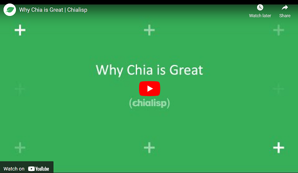
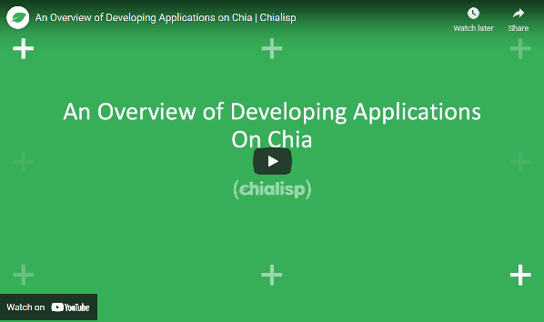
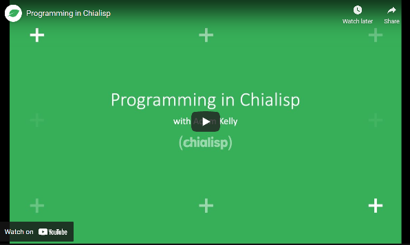

# [Chia Dev Sandbox](../README.md) > Getting Started

The main resources for Chialisp are:

  - [Chialisp website](https://chialisp.com/)
  - [Chialisp docs](https://chialisp.com/docs/)
  - [Video tutorials](https://chialisp.com/docs/tutorials/why_chia_is_great/)

We recommend watching the following videos for a quick overview of the language:

## Why Chia is Great

## An Overview of Developing Applications on Chia

## Programming in Chialisp

# Examples

Have a look at the following examples:

- [chia-checkers](../examples/chia-checkers/README.md)
- [chia-piggybank](../examples/chia-piggybank/README.md)
